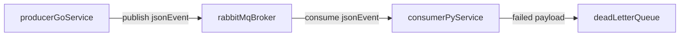

# Architecture

## Phase 1 Topology

## Service Responsibilities

- `producer-go`: accepts `POST /publish` and publishes JSON events to RabbitMQ.
- `consumer-py` or `consumer-dotnet`: consumes messages, validates required fields, processes payloads, and handles retries/DLQ routing.
- `rabbitmq`: message broker with main queue, retry queue, and dead-letter queue.

## Event Contract

Events use `contracts/message.schema.json` with:
- `schemaVersion`
- `message`
- `eventType`
- `timestamp`
- `traceId`

## Reliability Design

- Durable exchange and queues.
- Message persistence (`delivery_mode=2` / AMQP persistent delivery).
- Retry queue with TTL and dead-letter routing back to main queue.
- DLQ for malformed/failed messages after retry budget.

## Cloud-Agnostic Design

- Both services isolate broker details behind messaging adapter logic.
- Infrastructure details are configuration-driven (`.env` values).
- Business flow remains portable when swapping broker implementation later.
